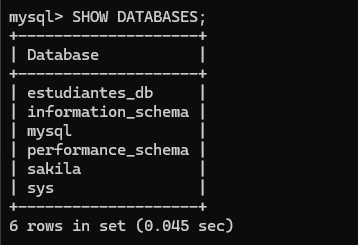
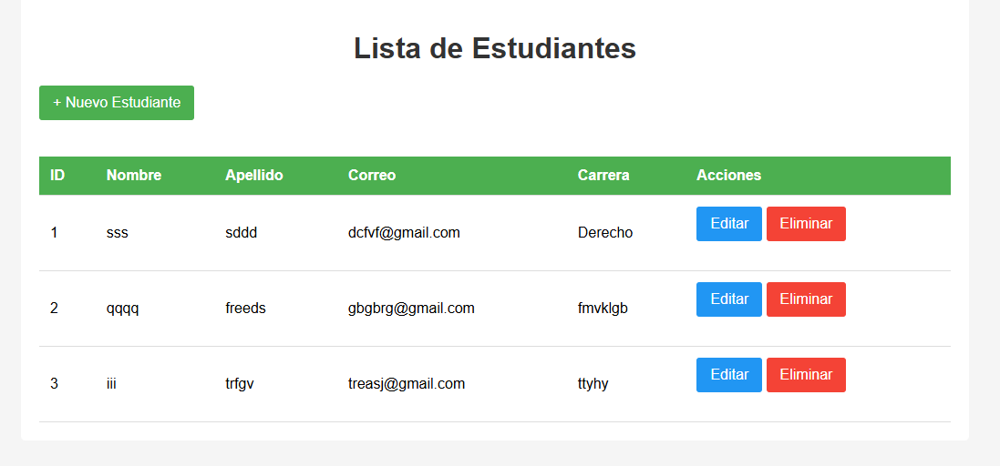
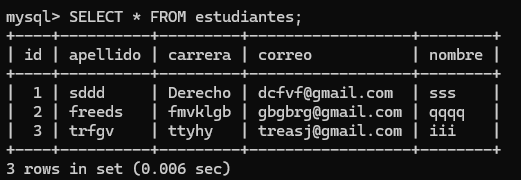
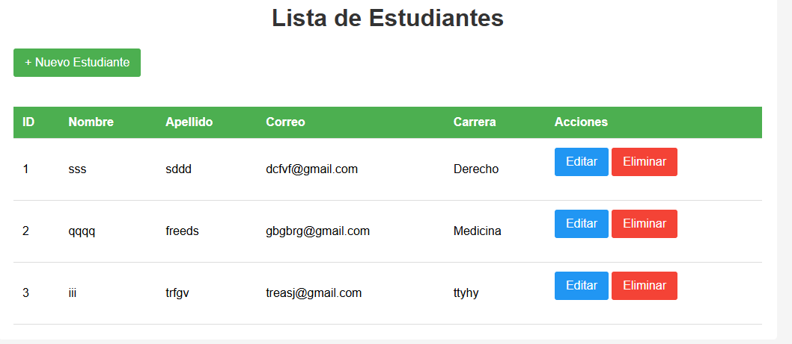
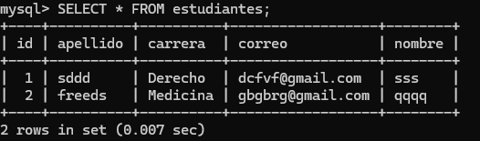
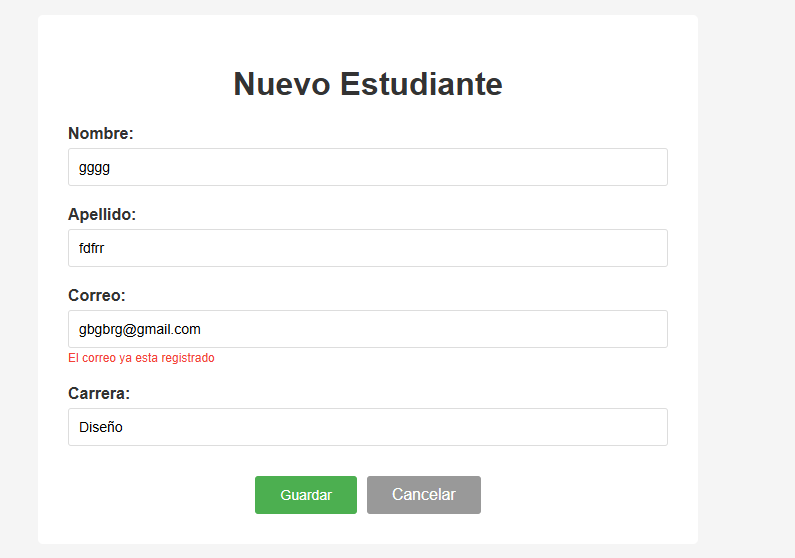

# Estudiantes App - CRUD con Spring Boot y JPA/Hibernate

Aplicación web para gestionar un CRUD completo de estudiantes utilizando Spring Boot, Spring Data JPA, Hibernate y MySQL.

## Requisitos Previos

- **Java 17+** instalado y configurado en PATH
- **MySQL 8.x** instalado y en ejecución
- **Maven 3.x** (incluido en el wrapper de Spring Boot)
- **IDE**: IntelliJ IDEA o VS Code con extensiones Java

## Cómo Ejecutar

### Opción 1: Con Maven Wrapper (recomendado)

```bash
cd c:\Users\DANNA\Documents\Visual Studio Code\Estudiantes
./mvnw spring-boot:run
```

### Opción 2: Con Maven instalado globalmente

```bash
mvn spring-boot:run
```

### Opción 3: Compilar y ejecutar JAR

```bash
./mvnw clean package
java -jar target/estudiantes-1.0.0.jar
```

## Evidencias del Taller (Capturas)

### Captura 1 - creación de la tabla "estudiantes" generado por Hibernate


### Captura 2 - Listado de estudiantes en el navegador


### Captura 3 - Verificar en MySQL: SELECT * FROM estudiantes


### Captura 4 - Edición de estudiante


### Captura 5 - Eliminar estudiante


### Captura 6 - Validación de correo duplicado (mensaje de error)



